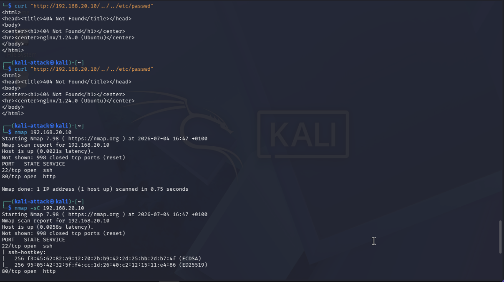
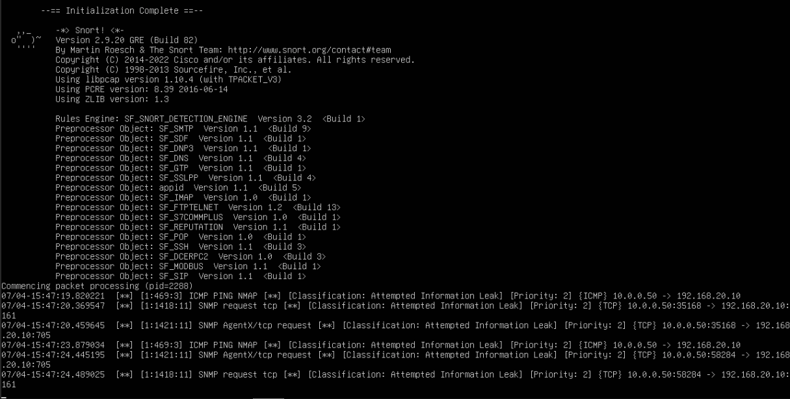

# Network Architecture: Multi-VLAN Segmented Lab

                Internet
                   |
       Home Router (192.168.1.1/24)
                   |
        +-- Proxmox Host (192.168.1.x)
        |
     vmbr0 (WAN) --+-- pfSense WAN (vtnet0, DHCP)
        |                          |
        |                  +-- pfSense LAN (vtnet1.10, 10.0.0.1/24)
        |                  |
        |                  +-- pfSense DMZ (vtnet1.20, 192.168.20.1/24)
        |                  |
        |                  +-- pfSense MGMT (vtnet1.30, 192.168.30.1/24)
        |                          |
        +-- vmbr1 (VLAN-aware) <---+
                |
        +-- VLAN 10 (LAN) --+-- Kali Linux (10.0.0.100/24)
        |                   +-- Windows Server (10.0.0.101/24) [Week 2]
        |                   +-- Windows 10 (10.0.0.102/24) [Week 2]
        |                   +-- Wazuh SIEM (10.0.0.50/24) [Week 3]
        |
        +-- VLAN 20 (DMZ) --+-- Ubuntu Web Server (192.168.20.10/24)
        |                   |   +-- Nginx
        |                   |   +-- Snort HIDS [Week 3]
        |                   |
        |                   +-- (future DMZ hosts)
        |
        +-- VLAN 30 (MGMT) --+-- (future management hosts)

### pfSense Firewall Configuration:

- WAN Interface: DHCP from home router, double-NAT lab setup
- LAN Interface: Static 10.0.0.1/24 with DHCP server (range: 10.0.0.100-200)
- Security Policy: Default-deny WAN policy with explicit HTTPS allow rule for management access
- Key Lesson: The "Block private networks" rule blocked my own laptop because WAN is RFC1918 behind a home router. Fixed by adding a specific source IP allow rule.

### Firewall Policy: 

-   Default-deny with explicit allow rules
-   DMZ blocked from initiating to LAN and MGMT
-   LAN allowed to reach DMZ services
-   Outbound NAT configured for internet access from all internal networks

### DMZ Infrastructure:

-    Ubuntu Server 24.04 (minimised) web server
-    Nginx serving a custom landing page

## Initial setup:
-   Ubuntu Server 24.04 (minimised) web server
-   Finalised Snort configuration with working alert generation
-   Verified detection of port scans, SQL injection, directory traversal, and XSS
-   Enabled Snort as a system service for persistent monitoring

## Validated Network Security Controls:
-   Confirmed DMZ isolation: blocked from LAN (10.0.0.0/24) and MGMT (192.168.30.0/24)
-   Verified LAN-to-DMZ access for legitimate web traffic
-   Tested outbound internet access from DMZ for updates

## Attack & Detection Workflow
-   Kali Linux (LAN) → nmap port scan → Snort alert: port scan detected
-   Kali Linux (LAN) → curl SQL injection → Snort alert: SQL injection attempt
-   Kali Linux (LAN) → curl directory traversal → Snort alert: traversal attempt
-   Kali Linux (LAN) → curl XSS payload → Snort alert: XSS attempt

## Skills Demonstrated:

-    Network segmentation (VLANs)	802.1q VLANs on Proxmox with pfSense routing
-    Firewall policy design	Default-deny, explicit allow, inter-zone blocking
-    NAT configuration	Outbound NAT for multiple internal networks
-    Host-based intrusion detection	Snort on DMZ server with custom rules
-    Threat simulation	Kali Linux reconnaissance and web attacks
-    Troubleshooting	Systematic diagnosis of routing, DNS, and service issues
-    Documentation	Network diagrams, alert logs

## Security Monitoring:

-   Snort host-based IDS installed directly on DMZ web server
-   Community rules + custom local rules for:
-   ICMP ping detection
-   SQL injection attempts
-   Directory traversal
-   Cross-site scripting (XSS)
-   Real-time alert output to alert.fast

